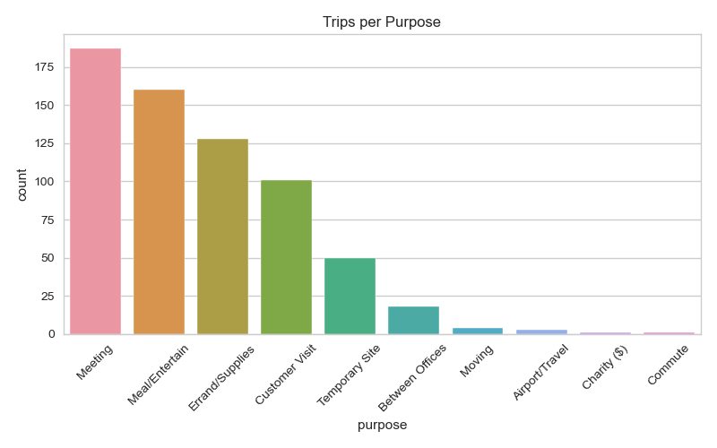
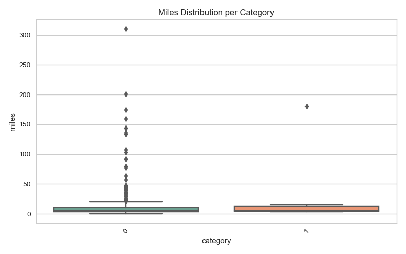

# 🚗 My Uber Drives - 2016 Data Analysis Project

This project analyzes and visualizes personal Uber ride data from the year 2016. The aim is to extract insights about trip patterns, usage behavior, and purposes behind the rides through various data cleaning, feature engineering, and visualization techniques.

---

## 📁 Dataset

- **Source**: Provided CSV file `My Uber Drives - 2016.csv`
- **Columns**:
  - `START_DATE*`, `END_DATE*`: Trip timestamps
  - `CATEGORY*`: Business or Personal
  - `START*`, `STOP*`: Locations
  - `MILES*`: Trip distance
  - `PURPOSE*`: Trip purpose (e.g., Meeting, Commute)

---

## ✅ Project Phases

### 🔹 Phase 1: Data Loading & Inspection
- Loaded CSV file
- Inspected null values, data types, and initial structure

### 🔹 Phase 2: Data Cleaning
- Handled missing values
- Removed invalid or incomplete rows
- Standardized column names

### 🔹 Phase 3: Data Preprocessing
- Renamed columns for consistency
- Parsed datetime fields
- Checked for duplicates and removed them

### 🔹 Phase 4: Feature Engineering
- Extracted new features like `hour`, `dayofweek`, and `month` from trip start time
- Encoded trip purposes

### 🔹 Phase 5: Modeling & Insights
- Aggregated and grouped data by purpose, category, and location
- Summarized trip counts and distances

### 🔹 Phase 6: Visualization
- Visualized:
  - Trips per purpose
  - Miles per trip category
  - Trips by hour, day of week, and month
- Libraries used: `matplotlib`, `seaborn`

---

## 📊 Sample Visuals




---

## 🛠️ Tech Stack

- Python (Pandas, Matplotlib, Seaborn)
- Jupyter Notebook
- CSV Data

---

## 🚀 How to Run

1. Clone the repo or download the notebook
2. Ensure the dataset file `My Uber Drives - 2016.csv` is in the same directory
3. Install required libraries if needed:
   ```bash
   pip install pandas matplotlib seaborn
